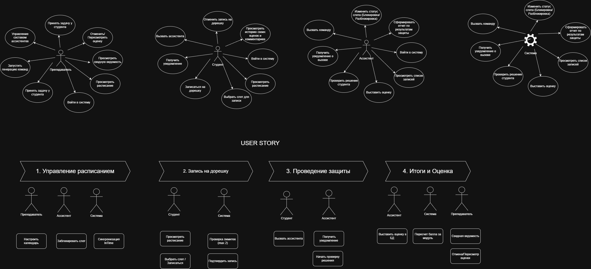
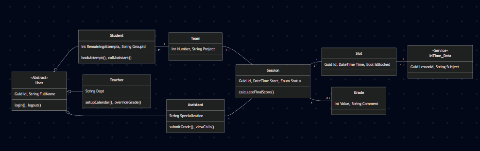
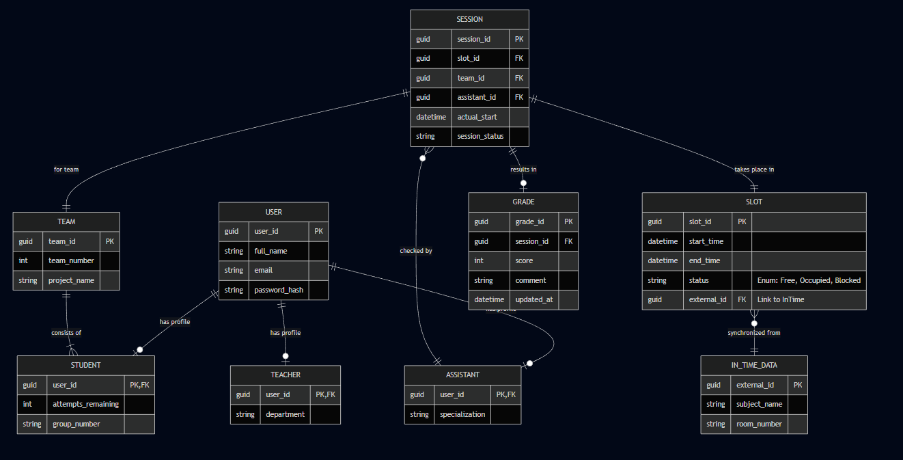
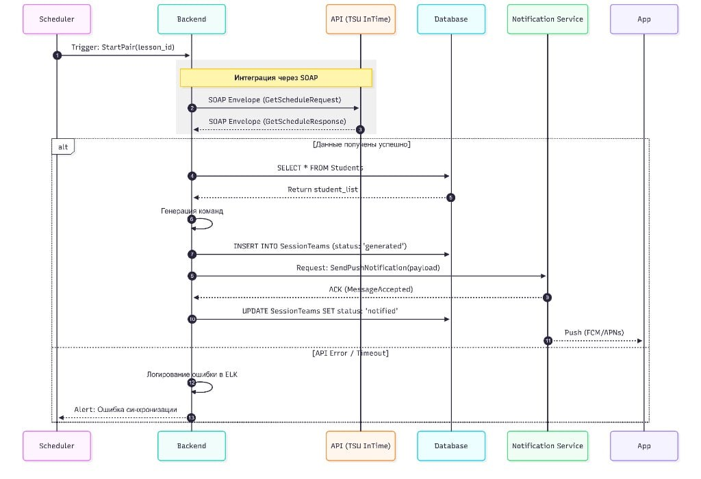
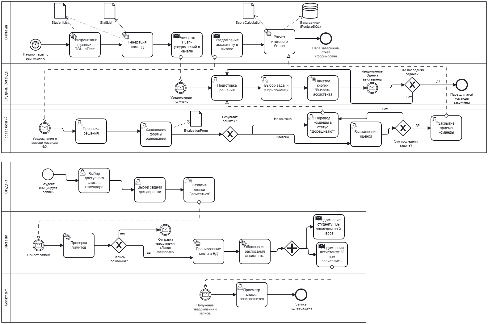

# ScoreHub

Проект представляет собой комплексное решение для управления процессом защиты учебных работ («дорешек»). Система автоматизирует распределение студентов по командам, запись на свободные слоты и учет оценок с интеграцией внешних данных.

## Стек
* **Database:** PostgreSQL
* **Integration:** SOAP (TSU InTime API), Push Notifications (FCM/APNs)
* **Design & Analysis:** UML, BPMN, Draw.io

## Анализ требований

### Use Case 
Диаграмма описывает границы системы и ключевые взаимодействия пользователей (Студент, Ассистент, Преподаватель) с функционалом приложения.

### Матрица прав доступа
| Функция | Студент | Ассистент | Преподаватель |
| :--- | :---: | :---: | :---: |
| Войти в систему | ✅ | ✅ | ✅ |
| Просмотреть расписание | ✅ | ✅ | ✅ |
| Выбрать слот для записи | ✅ | — | — |
| Записаться на дорешку | ✅ | — | — |
| Отменить запись | ✅ | — | — |
| Просмотреть список записей | — | ✅ | ✅ |
| Блокировка/Разблокировка слота | — | ✅ | ✅ |
| Вызвать ассистента | ✅ | — | — |
| Получить уведомление о вызове | — | ✅ | ✅ |
| Проверить решение студента | — | ✅ | ✅ |
| Выставить оценку | — | ✅ | ✅ |
| Пересмотреть/Отменить оценку | — | — | ✅ |
| Сформировать отчет по защите | — | — | ✅ |
| Просмотреть сводную ведомость | — | — | ✅ |
| Запустить генерацию команд | — | — | ✅ |
| Управление составом ассистентов | — | — | ✅ |

---

## Архитектура системы

### Модель предметной области
Логическая структура классов, отражающая бизнес-сущности и их взаимосвязи.

### Схема базы данных (ERD)
Физическая модель данных PostgreSQL, включая связи один-ко-многим и наследование ролей пользователей.

## Процессы и интеграции

### Синхронизация и генерация (Sequence Diagram)
Процесс взаимодействия бэкенда с планировщиком (Scheduler), внешней базой TSU InTime через SOAP и сервисом уведомлений.

### Use Case Diagram (Сценарии использования)
Диаграмма визуализирует ключевые функции системы для каждой роли и определяет границы ответственности.

### User Stories
Для описания логики проекта мы использовали формат User Stories, сгруппированных по эпикам:

#### 1. Управление расписанием (Schedule)
* **Преподаватель:** «Я хочу настраивать календарь доступных слотов, чтобы студенты видели актуальное время для защиты».
* **Система:** «Я должна синхронизировать данные с API TSU InTime, чтобы исключить накладки с основным расписанием».

#### 2. Запись на дорешку (Booking)
* **Студент:** «Я хочу забронировать свободный слот, чтобы гарантированно защитить работу в выбранное время».
* **Система:** «Я должна проверять остаток попыток (max 2), чтобы соблюдать регламент курса».

#### 3. Проведение защиты (Defense)
* **Студент:** «Я хочу вызвать ассистента через приложение, чтобы он подошел к моему рабочему месту».
* **Ассистент:** «Я хочу получать Push-уведомления о вызовах, чтобы оперативно реагировать на запросы студентов».

#### 4. Итоги и Оценка (Grades)
* **Ассистент:** «Я хочу выставлять оценку сразу в БД, чтобы данные мгновенно попадали в ведомость».
* **Преподаватель:** «Я хочу иметь возможность пересмотреть оценку, чтобы разрешать спорные моменты».
  
## Описание бизнес-процессов (BPMN)

Для проекта разработаны детальные схемы процессов, разделенные на два ключевых сценария: **проведение учебной пары** и **предварительная запись**.

### 1. Процесс проведения защиты
Этот сценарий описывает взаимодействие системы, студента и проверяющего (ассистента) во время занятия.

**Ключевые этапы:**
* **Автоматизация:** Система самостоятельно синхронизирует списки, генерирует команды и рассылает Push-уведомления.
* **Взаимодействие:** Студент инициирует вызов ассистента кнопкой в приложении, что минимизирует время ожидания.
* **Завершение:** Процесс считается оконченным только после выставления оценки в БД и автоматического расчета итогового балла.

### 2. Процесс записи на дорешку (Booking Flow)
Сценарий описывает логику резервирования слотов вне рамок занятий.

**Важные бизнес-правила:**
* **Валидация:** Система выполняет автоматическую "Проверку лимитов". Если лимит попыток исчерпан, студент получает уведомление об отказе.
* **Синхронизация:** При успешном бронировании обновляется расписание ассистента и отправляются подтверждающие уведомления обеим сторонам.
